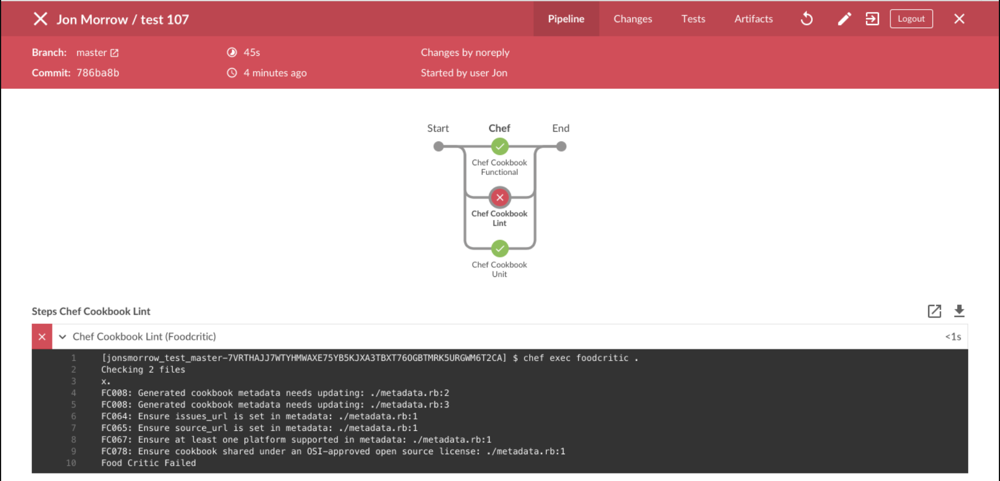

# Chef Cookbook Pipeline Plugin for Jenkins

## Getting Started

The Chef Cookbook Pipeline Plugin for Jenkins makes it easy to build deployment pipelines for Chef cookbooks visually using Jenkins' Blue Ocean plugin. Currently the plugin has unit testing, linting, and functional testing capabilities using the following custom steps:
- Chef Cookbook Unit
- Chef Cookbook Lint (Foodcritic)
- Chef Cookbook Lint (Cookstyle)
- Chef Cookbook Functional
- Chef Cookbook Publish to Chef Server

## Prerequisites

- Jenkins installation, at least version 2.73, with Blue Ocean installed
- A cookbook you want to test
- A few files to put in your cookbook (These files are available on [Github Releases](https://github.com/chef/chef-jenkins-plugin/releases))
  * Dockerfile
  * .kitchen.docker.yml
  * Jenkinsfile to describe the pipeline itself

## Installing the Plugin

The easiest way to install the plugin is to download the latest hpi from [Github Releases](https://github.com/chef/chef-jenkins-plugin/releases).

Once this is downloaded login to your Jenkins instance and navigate to manage plugins by clicking manage Jenkins on the left and the manage plugins. Next click the advanced tab and use the upload plugin section to upload and install the hpi.

## Setting up your cookbook

As mentioned in the prerequisites there are three files you will need to checkin to the root of your cookbook. The Dockerfile and Jenkinsfile can be used as is but you'll want to customize the .kitchen.docker.yml for the platforms and suites your cookbook uses.

## Creating the Cookbook Pipeline

Go to the Jenkins console and click Open Blue Ocean in the left nav. Click New Pipeline on the ride side of the screen. Blue Ocean will walk you through the creation of a pipeline based on the Jenkinsfile in your cookbook.

Blue Ocean will build and run the cookbook pipeline for you. You should see something similar to the screenshot below, which shows the test cookbook pipeline with unit, lint, and functional stages reporting a Foodcritic failure.



## ChefDK/Docker Scenario

The plugin supports different topologies, but the variation described here consists of a local standalone workstation running Docker and Jenkins as Jenkins master. To execute the test cookbook pipeline, Jenkins master spins up a Docker container running ChefDK as a Jenkins worker. The stages and steps of the pipeline invoke ChefDK operations which perform unit testing, linting (Foodcritic, Cookstyle), and functional testing (Test Kitchen) of Chef cookbooks. Test Kitchen spins up additional Docker containers as siblings to its own container in which to execute functional testing of cookbooks on different platforms.

## Build Prerequisites

- Git
- Maven 3.5+
- JDK 1.8+

## Building the Plugin

Download the [repository](https://github.com/chef/chef-automate-plugin.git). You'll need the right Maven settings, so create a settings.xml file at ```~/.m2``` and add the following Jenkins profile. If you already have a settings.xml file, you only need to add the bits you're missing.

```
<settings>
  <pluginGroups>
    <pluginGroup>org.jenkins-ci.tools</pluginGroup>
  </pluginGroups>

  <profiles>
    <!-- Give access to Jenkins plugins -->
    <profile>
      <id>jenkins</id>
      <activation>
        <activeByDefault>false</activeByDefault> <!-- you could set this to false if you use Maven for more than just Jenkins development. if you do, make sure to always add the -P jenkins argument to Maven invocations -->
      </activation>
      <repositories>
        <repository>
          <id>repo.jenkins-ci.org</id>
          <url>https://repo.jenkins-ci.org/public/</url>
        </repository>
      </repositories>
      <pluginRepositories>
        <pluginRepository>
          <id>repo.jenkins-ci.org</id>
          <url>https://repo.jenkins-ci.org/public/</url>
        </pluginRepository>
      </pluginRepositories>
    </profile>
  </profiles>
  <mirrors>
    <mirror>
      <id>repo.jenkins-ci.org</id>
      <url>https://repo.jenkins-ci.org/public/</url>
      <mirrorOf>m.g.o-public</mirrorOf>
    </mirror>
  </mirrors>
</settings>
```

Build the plugin and run Jenkins:

```$ mvn -P jenkins -U hpi:run```

This command will build the plugin and launch Jenkins with the plugin installed. Copy the temporary admin password at the tail end of the Maven output; you'll need it to log in to the Jenkins console.

Go to the Jenkins console [login screen](http://localhost:8080/jenkins). At the login prompt, log in as admin using the temporary admin password located in the Maven build/run output. Once you're logged in, you can either continue as admin or let Jenkins walk you through the creation of your first admin user. Either choice is fine, because in this scenario Jenkins will run as your own user regardless of which user you use to log in to the Jenkins console.

Install plugin runtime dependencies:

Once you're logged in to the Jenkins console, install the Warnings Plug-in. Click Manage Jenkins on the left nav, then click Manage Plugins. Click the Available tab, then enter Warnings in the filter box just above the plugins list on the right. Click the checkbox next to Warnings Plug-in in the plugins list, then click Install Without Restart. When the plugin is installed, navigate back to the main Jenkins dashboard by clicking the Jenkins breadcrumb on the top left.

## Build the plugin:

```$ mvn -P jenkins -U package```

## Creating a release:

```$ mvn -P jenkins -U package```

# License

Copyright (C) 2017 Chef Software Inc.

The terms of the Development Feedback Agreement (Chef Cookbook Pipeline
Plugin for Jenkins) between Chef Software Inc. and the party accessing
this file ("Licensee") apply to Licensee's use of the Software until such
time that the Software is made available under an open source license such
as the Apache 2.0 License.
